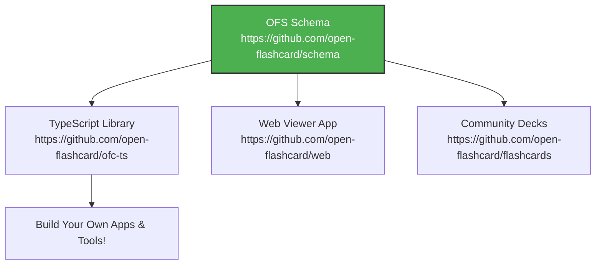

# Open Flashcard Standard (OFS) 🚀

**An open, portable JSON schema for flashcard data.**  
Your flashcards. Your rules. No more lock-in. Break free from proprietary prisons and own your knowledge forever! 🌟

## The Problem

Your flashcards are trapped. Anki uses `.apkg` with SQLite. Quizlet locks data behind their API. SuperMemo has its own format. When you want to switch apps, share decks, or build your own tools, you're stuck converting between incompatible formats—losing formatting, media, and study history along the way.

Flashcards are simple: a question on one side, an answer on the other. Why is the data so complicated?

## The Solution 🔥

Open Flashcard Standard (OFS) is a clean JSON schema that **any app** can read and write. No databases, no proprietary nonsense—just plain JSON files you can open in any text editor, git-track, or share effortlessly.

**Why it's awesome:**
- **Multi-sided cards** — Classic term/definition, or cards with multiple sides for complex topics
- **Rich content types** — Plain text, Markdown, HTML, LaTeX math, code blocks with syntax highlighting
- **Media support** — Images, audio, video, and text-to-speech with full accessibility (captions, descriptions)
- **Multiple choice** — Quiz-style cards with single or multiple correct answers, hints, and explanations
- **Spaced repetition** — Metadata fields for SRS algorithms (compatible with FSRS, SM-2, Leitner)
- **Extensible** — Custom content types via plugins, arbitrary metadata, deck inheritance
- **Internationalization** — RTL support, language tags, custom fonts

### Project Ecosystem

- **Core Schema** — The foundation: [github.com/open-flashcard/schema](https://github.com/open-flashcard/schema)
- **TS Library** — Easy read/write in TypeScript: [github.com/open-flashcard/ofc-ts](https://github.com/open-flashcard/ofc-ts)
- **Web Viewer** — Browser-based flashcard app: [github.com/open-flashcard/web](https://github.com/open-flashcard/web)
- **Sample Decks** — Community-shared flashcards: [github.com/open-flashcard/flashcards](https://github.com/open-flashcard/flashcards)

## Contributing 🤝

We welcome contributions! Whether it's adding content types to the schema, building importers/exporters for other formats, or creating sample decks—open an issue or PR in the relevant repo.

Let's revolutionize learning together! Your ideas can shape the future of flashcards. 🌍

## License

MIT - Use it however you want. Your flashcards belong to you.

**Join the open flashcard revolution. Your brain deserves freedom!** 💡🔥
